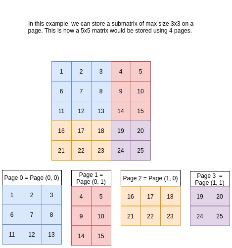
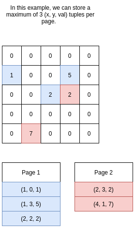

## Page Layout

For a normal matrix, we are storing the matrix using submatrices where every page has one submatrix. The size of the submatrix to be stored in each page is determined by the limit of the BLOCK_SIZE value. This ensures that each page contains maximum possible sized submatrix.

---

## Compression Technique

For sparse matrix, we are storing tuples (x, y, val != 0) in sorted (ascending) order in the pages. The number of elements that can be stored in each page are determined by the BLOCK_SIZE value to minimize number of pages. 

---

## Compression Ratio

Assume the Sparse matrix has **n** elements, out of which **o** elements are 0. Then the sparsitiy of the matrix is (n-o)/n.  
The size of the matrix using normal matrix representation would be = n \* sizeof(int) bytes  
The size of the matrix using (x, y, val != 0) representation would be = (n-o) \* 3 \* sizeof(int)  
So the compression ratio is: ((n-o) \* 3 \* sizeof(int)) / (n \* sizeof(int)) = 3 \* (n-o)/n

---

## Transpose Operation

### Normal Matrix
For a normal matrix, note that we can represent all the pages using two indices, (i, j) to indicate their position in the original matrix. So page0 is (0, 0) and page1 is (0, 1) etc. Then we can do the transpose using the following:

1. Select a page and find its (i, j) value
2. if j > i, do nothing and continue on to the next page
3. if i == j, then transpose the page
4. if i < j, then fetch the page (j, i), transpose both of them, and write the transpose of page (i, j) to page (j, i) and vice versa

### Sparse Matrix
For a sparse matrix, we can find the transpose of the matrix by exchanging the row,col for the non zero values stored in all the pages (x, y, val) to (y, x, val). The values are then sorted across all pages to maintain the ordering of the values in the transposed matrix.

---
